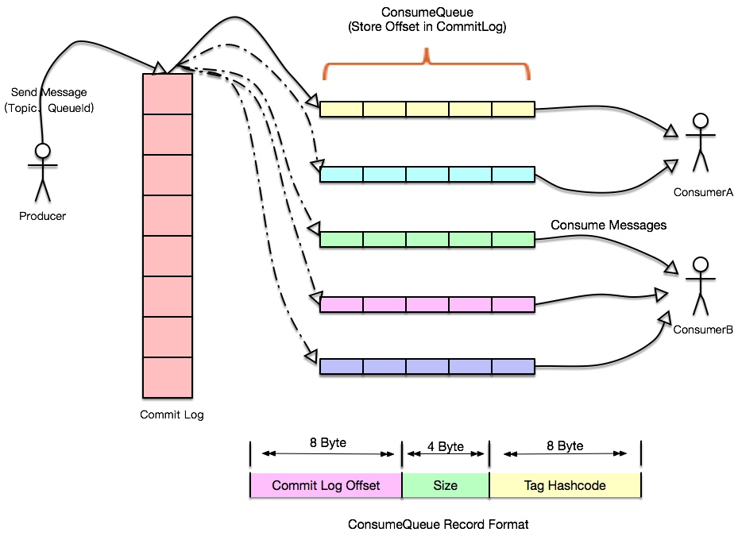

## RocketMQ Integration

### Preface

> Why RocketMQ

借助rocketMQ提供的分布式事务的特性，可以帮助我们轻松实现在非传统场景(RDBMS)下的事务问题/一致性问题，e.g., 持久层更新后的缓存与持久层的一致性问题


___

### RockerMQ

**Core Concept**

* A typical message system model
  
  we can dig deeper into some topics about messaging system design:
  * Consumer Concurrency
  * Consumer Hot Issues
  * Consumer Load Balance
  * Message Router
  * Connection Multiplex
  * Canary Deployments // 金丝雀部署，部分发布
  
* Producer
  send messages to brokers
  sending paradigms
    * synchronous
    * asynchronous
    * one-way // 单方面的

* Producer Group
  Producers of the same role are grouped together. 当原有的生产者在transaction后crash掉，在同生产者组内的另一个生产者实例将会与中介者进行联系(contact)并继续提交(commit)或回滚(roll back)事务
  > Warning
  鉴于现有的producer足以应对发送消息，每个producer group只允许一个实例存在以避免冗余

* Consumer
  pulls messages from brokers and feeds them into application. two types of consumer are provided:
  * PullConsumer
  actively pulls messages from brokers. Once batches of msgs are pulled, user application initiates consuming process.
  * PushConsumer
  includes message pulling, consuming progress and maintaining other work inside,leaving a callback interface to end user to implement which will be executed on msg arrival.

* Consumer Group
  consumers of exactly same role are grouped together. It is a great concept with which achieving goals of load-balance (负载均衡) and fault-tolerance (容错), in terms of msg consuming, is super easy.
  > Warning
  consumer instances of a consumer group must have exactly the same topic subscription(s).

* Broker
  It receives messages sent from producers, store them and prepare to handle pull requests from consumers. It also stores message related meta data, including consumer groups, consuming progress offsets and topic/queue info.

* Name server
  serves as the routing information provider. Producer/Consumer clients look up topics to find the corresponding broker list.

* Topic
  A category in which producers deliver messages and consumers pull messages. Topics have very loose relationship with producers and consumers.
  

* Message
  information to be delivered.
  * topic
  * optional tag and extra k-v pairs, e.g., msg ref for lookup op
    * Tag
      i.e., sub-topic, provides extra filexibility to users. Msg with different purposes from the same business module may have the same topic and different tag. Tags would be helpful to keep your code clean and coherent, and tags also can facilitate the query system RocketMQ provides.
  
* Message Queue
  Topic is partitioned into one or more sub-topics

* Message Model
  * Clustering
  * Broadcasting
  
* Message Order
  the order for consume message
  * Orderly
    messages are consumed the same order they are sent by producers for each msg queue. If you are dealing with scenario that global order is mandatory (强制的), make sure the topic you use has only one msg queue.

    > Warn: If consuming orderly is specified, the maximum concurrency of msg consuming is the number of msg queues subscribed by the consumer group
    
  * Concurrently
    maximum concurrency of msg consuming is only limited by thread pool specified for eaxh consumer client.

    > Warn: Msg order is no longer guaranteed in this mode
___

**Architecture**


* NameServer Cluster
  Name Servers provide lightweight service discovery and routing. Each Name Server records full routing information, provides corresponding reading and weiting service, and supports fast storage expansion.

* NameServer
  * Broker Management
    accepts the register from Broker cluster and provides heartbeat mechanism to check whether a broker is alive
  * Routing Management
    each NameServer will hold whole routing info about the broker cluster and the queue info for clients query

  > How do clients find NameServer address?
  
  * Programmtic Way, like `producer.setNamesrvAddr("ip:port")`
  * Java Options, use `rocketmq.namesrv.addr`
  * Environment Variable, use `NAMESRV_ADDR`
  * HTTP Endpoint
  
* Broker Cluster
  Brokers take care of msg storage by providing lightweight TOPIC and QUEUE mechanisms. 
  
  They support the Push and Pull model, contains fault tolerance mechanism (2 copies or 3 copies)

  Provides strong padding of peaks and capacity of accumulating hundreds of billion messages in their original time order.
  
  In addition, Brokers provides disaster recovery, rich metrics statistics, and alert mechanisms (all lacks in traditional messaging systems)

* Broker Server
  responsible for message store and delivery, message query, HA guarantee..., serval important sub modules:

  * Remoting Module
    the entry of broker, handles the request from clients
  * Client Manager
    manages the clients (Producer/Consumer) and maintains topic subscription of consumer
  * Store Service
    provides simple APIs to store or query msg in physical disk
  * HA Service
    provides data sync feature between master broker and slave broker
  * Index Service
    builds index for messages by specified key and provides quick message query

  
  
* Producer Cluster
  Distributed Producers send messages to the Broker cluster through multiple load balancing modes. The sending processes support fast failure and have low latency

* Consumer Cluster
  Consumers support distributed deployment in the Push and Pull model as well. It also supports cluster consumption and message broadcasting. It provides real-time message subscription mechanism and can meet most consumer requirements.
___

**Transcation**

* transactional message
  can be tought of as a two-phase commit message implementation to ensure eventual consistency in distributed system. It ensures that the execution of local transcation and the sending of message can be performed atomically

* Half/Prepare Message
  msg is successfully sent to the MQ server, but the server did not receive the second ack of msg from the producer, then the msg is marked as 'temporarily undeliverable'

* Message Status Check
  When MQ server finds that a message remains a half message for a long time, it will send a request to the message producer, checking the final status of the message (Commit or Rollback)

* Usage Constraint
  * have no schedule and batch support
  * default check maximum for a single msg: 15, if not sent success, the broker will discard this msg and print an error log.
  * check period `transactionMsgTimeout`
  * a transactional msg maybe checked or consumed more than once
  * producer IDs of msg cannot be shared with producer IDs of other types of msg. Allow backward queries, MQ Server query clients by their producer IDs
  
* Application

* Transactional status
  * TransactionStatus.CommitTransaction // 1
  * TransactionStatus.RollbackTransaction // 2
  * TransactionStatus.Unknown // 0
    MQ is needed to check back to determine the status

* Send transactional producer
  * Create the transactional producer
    After exexutiing the local transaction, you need to reply to MQ according to the execution result, and the reply status is above
  * Implement the TranscationListener interface
    * `executeLocalTransaction`
      execute local transaction when send half msg succeed, it returns one of three transaction status as above
    * `checkLocalTransaction`
      check the local transaction status and repond to MQ check requests. Also return transaction status


___

**Load Balance**

* Broker
  Broker以group为单位提供服务，在一个group里区分master和slave，slave从master同步数据；经由nameServer暴露给client后，可以抽象为一个个topic的路由信息，细化为msg queue进行发送。对于client来说，分布在不同broker group的msg queue构成了一个服务集群，这样一来，压力分摊到了不同的queue上，自然也分摊到了不同的broker group上

* Producer
  每个实例在发送消息的时候，默认会轮询所有的msg queue进行发送，达到消息平均落在不同的queue上，进而发送到不同的broker上

  
  
* Consumer
  * cluster
    集群消费模式，每条消息会投递到订阅topic下的consumer group的一个实例上。这时使用pull的主动拉取方式，指定哪一条msg queue进行拉取
  
    每次实例的数量有变更，都会触发一次所有实例的负载均衡，按照queue的数量和实例的数量平均分配queue给每个实例 (AllocateMessageQueueAveragely)
    
    > Warn: 集群模式下queue只能分配给一个实例，由于拉取消息是由consumer主动控制的，有可能导致同一个实例重复消费

___

### Storage

**Offset 存储**

Offset是指某个Topic下的一条消息在某个Message Queue里的位置，通过Offset可以定位到这条消息/指示Consumer从这条消息开始向后继续处理


Offset分为 **本地文件类型** 和 **Broker代存** 两类。
* DefaultMQPushConsumer
  * 默认的clustering模式，也就是同一个Consumer group里的多个消费者每人消费一部分，各自收到的消息内容不一样。在这种情况下，由Broker端存储和控制Offset的值，即RemoteBrokerOffsetStore
  * Broadcasting模式下，每个Consumer都会收到这个Topic的全部消息，各个consumer间相互没有干扰，则使用localFileOffsetStore，把Offset存到本地

Offset使用JSON存储:

```
{”OffsetTable”:{{”brokerNarne":"localhost”,”QueueId”:1,”Topic”:”brokerl" ):
1, { ”brokerNarne””localhost”,”QueueId”:2,”Topic":”brokerl" ):2, { ”brokerNarne”:”localhost”,”QueueId”:口，”Topic":”brokerl" ):3 ) )
```


* PullConsumer 需要自行处理OffsetStore


ConsumeFromWhere的设置优先级低于Offset Store的，当读取不到Offset的时候才生效。如果Consumer正常运行后被停止，然后再启动，会接着上次的Offset开始消费，ConsumeFromWhere的设置无效

**Log 日志存储**

`home\logs\rocketmqLogs`

## 消息队列的核心机制

Broker是RocketMQ的核心，大部分”重量级“工作都是由Broker完成的，包括接收Producer发过来的消息、处理Consumer的消费消息请求、消息的持久化存储、消息的HA机制和服务端过滤功能

诸如Kafka之类的消息中间件，在队列数上升时性能会产生巨大的损失，而RocketMQ之所以能单机支持上万的持久化队列与其存储结构密不可分

### 消息的存储


RocketMQ消息的存储是由ConsumeQueue和CommitLog配合完成的:

**CommitLog**

消息真正的物理存储文件，每台Broker上的CommitLog被本机器所有ConsumeQueue共享，位于 `${storeRoot}\${commitlog}\${fileName}`

CommitLog中，一个消息的存储长度是不固定的，顺序写，随机读
* 顺序写入CommitLog，提升写入效率
* 随机读，利用操作系统的pagecache机制，批量从磁盘读取，作为cache存到内存中，加速后续的读取速度
* 使用ConsumeQueue保证完全的顺序写入:
  ConsumeQueue里只存偏移量信息，大小有限；在实际情况中，大部分的ConsumeQueue能被读入到内存中，所以这个中间结构操作速度很快 (内存读取速度)；
  CommitLog存储了ComsumeQueues，Message Key、Tag等信息，即便ConsumeQueue丢失，也可以通过commitLog完全恢复出来

**ConsumeQueue** 

消息逻辑队列，类似数据库索引文件
  每个Topic下的每个Message Queue都有一个对应的ConsumeQueue文件，位于 `${storeRoot}\consumequeue\${topicName}\${queueId}\${fileName}`
  
  RocketMQ的消息过滤方式是在订阅时，再做过滤
  * Broker端进行tag比对，先遍历consume queue，如果存储的message tag和订阅的tag不符合，则跳过比对下一个，符合则传输给consumer (比较hashcode)
  * consumer收到过滤后的消息后，同样进行broker短的操作，对比是否符合tag (比较真实字符串)



如图所示，所有的消息数据单独存储到一个Commit Log中，完全顺序写，随机读。对最终用户展现的队列实际只存储消息在Commit log中的位置信息，且以串行方式刷盘
* 队列轻量化，单个队列数据量非常少
* 对磁盘的访问串行化，避免磁盘竞争，不会因为队列增加导致IO wait增高

但是相应有如下缺点:
* 写虽然完全是顺序写入，但是读却变成了完全的随机读
* 读一条消息，会先读取Consume Queue，再读Commit Log，增加了开销
* 要保证Commit Log与Consume Queue的完全一致，增加了编程复杂度

解决方案:
* 随机读，尽可能让读命中pagecache，减少IO操作，所以内存越大越好。同时保证不会因为系统中堆积的消息过多，而发生由于随机读导致的性能急剧下降:
  * 访问pagecache时，系统会提前预读出更多数据，下次读的时候就可能命中内存
  ...
* 由于Consume Queue存储数据量少，而且为顺序读，在pagecache预读作用下性能几乎与内存一致
* Commit Log中存储了所有元信息，包含消息体，ComsumeQueues，Message Key、Tag等信息，即便ConsumeQueue丢失，也可以通过commitLog完全恢复出来


### 同步/异步刷盘

**异步刷盘**

返回写成功状态时，消息可能只被写入到了内存的pagecache中，写操作的返回快，吞吐量大；内存的消息量累积到一定程度后，统一触发写磁盘操作，快速写入

**同步刷盘**

返回写成功状态时，消息已经被写入磁盘: 消息写入内存的pagecache后，立刻通知刷盘线程刷盘，等待其完成后，唤醒等待线程，返回消息写成功状态


Broker配置 `flushDiskType` enums SYNC_FLUSH, ASYNC_FLUSH

### 同步复制和异步复制

一个Broker组有Master和Slave，消息需要从Master复制到Slave上，同步复制需要等待Master和Slave均写成功后才反馈给客户端写成功状态；异步复制则是只要等到Master写成功即可反馈客户端写成功状态

异步复制方式下，系统有较低的延迟和较高的吞吐量，但是如果Master故障，有些数据因为没有写入到Slave，有可能会丢失; 同步复制情况下，Master故障，Slave上有全部数据，容易恢复，但是相应会增大写入延迟，降低系统吞吐量

Broker 配置 `brokerRole` enums ASYNC_MASTER, SYNC_MASTER, SLAVE

通常来说应该把Master和Slave配置为ASYNC_FLUSH刷盘，主从之间设置为SYNC_MASTER的复制方式

### 消息查询


按照Message Id查询消息，MsgId共16字节，包含消息存储主机地址


按照Message Key查询消息，rocketmq可以为每条消息指定key，并以此建立索引，这里的key是发送消息时，在其propety字段中的keys值，以空格分割的每个关键字都会产生一个索引；同时，如果propety字段中包含UNIQ_KEY时，也会为他创建一个索引。索引逻辑结果如上，查询时：
* 根据查询的key的hashcode%slotNum得到槽的位置
  slotNum是一个索引文件里包含最大槽的数目
* 根据slotValue (slot位置对应的值) 查找到索引项列表最后一项 (倒序排列，slotValue总是指向最新的一个索引项)
* 遍历索引项列表返回查询时间范围内的结果集 (default 32)

___
### Appendix


