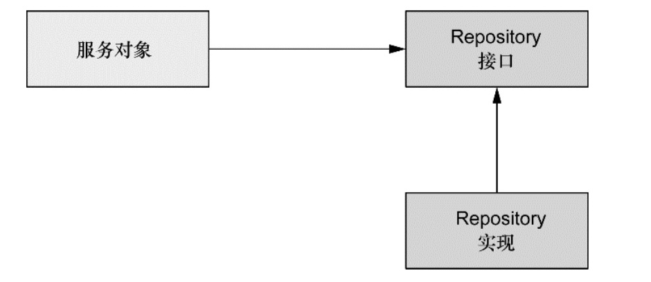
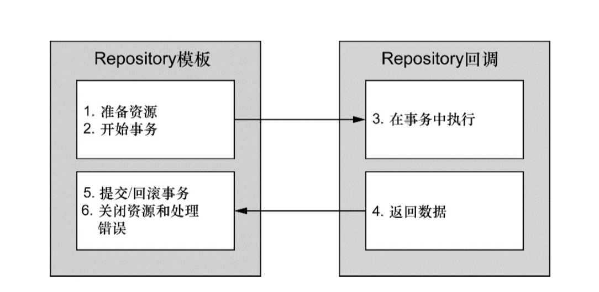
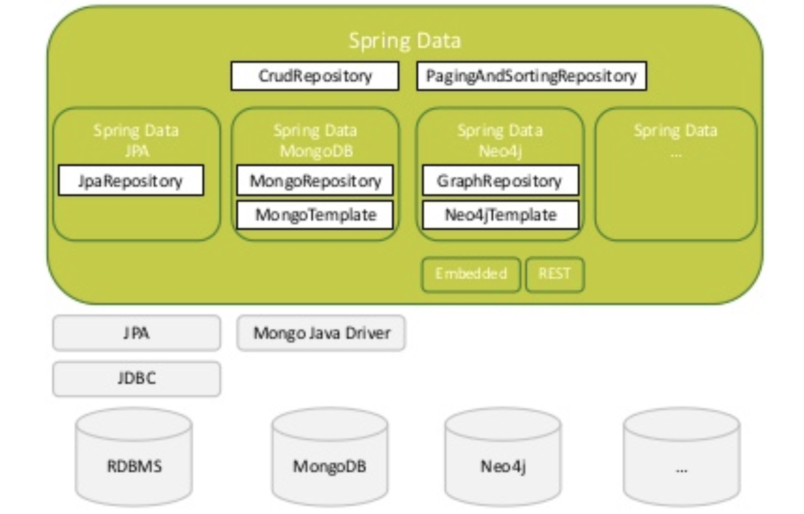
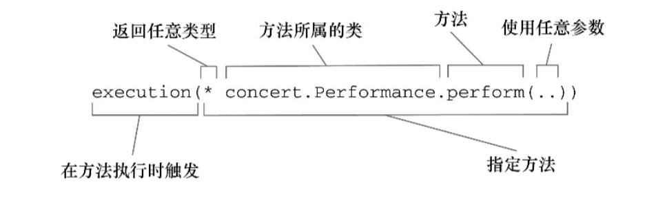
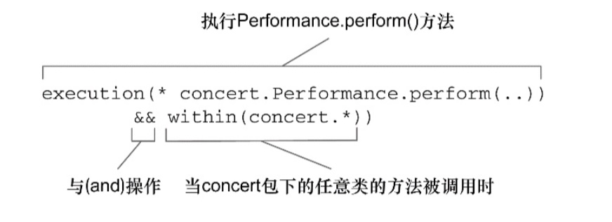

## Spring Data Mongodb

### Preface

**Spring的数据访问哲学**

**面向接口编程**

对于接口而言，是将规范和约束与具体实现分离的合同定义，也是对对象进行的抽象。实际上面向接口编程的时候，我们需要根据不同的环境因素(外部，逻辑)，按照确定的合约进行实现；而在使用合约时，应该避免对特例的依赖，按照统一的合约进行使用



通过repository接口确保repository的实现与服务对象之间的松耦合：

* 易于测试
* 数据访问层是以与持久化技术无关的方式进行访问的

**数据访问异常**

> 目标

一个成体系的，对数据访问异常具备描述性而又与特定的持久化框架无关的异常体系

> 实现

spring提供了众多的数据操作异常，他们都继承自 `DataAccessException`，其特殊之处在于它是一个非检查型异常，并不一定要求捕获。spring认为很多异常问题不是能在catch代码块中进行修复，而将异常捕获的权利留给开发人员

**数据访问模板化**

模板方法定义主要框架，模板方法将过程中与特定实现相关的部分委托给接口，而这个接口的不同实现定义了过程中的具体行为

spring将数据访问规定的和可变部分划分为两类：模板(template)和回调(callback)。如下，模板会处理事务、管理资源与异常，而在回调中处理参数、语句和整理结果集



**Why Not JPA**

对于传统关系型数据库，JPA的抽象是一种很好的实践。但是对于NoSQL类型的数据存储而言，由于这些存储的特征各异，导致它们要使用完全不同的driver才能使用，如果驶入对这样的差异进行抽象的话，会失去相应特性的支持。e.g., 缺少mongodb的文档-对象映射、地理空间操作、aggregation等功能的支持
___

### Spring Data

Spring Data对此的目标是为不同的持久层提供一个基于Spring编程模型，熟悉的、一致的数据访问手段，同时保留各自的特性和功能，帮助我们在使用不同存储的时候会有一致的体验



**Spring Data的简化**

* 简化资源管理操作，连接、释放
* 简化并支持对所有的存储进行资源配置，从而实现对该存储的访问 (XML || JavaConfig)
* 异常处理转化为Spring的`DataAccessException`，一个非检查型异常，并不一定要求捕获。spring认为很多异常问题不是能在catch代码块中进行修复，而将异常捕获的权利留给开发人员
* 基于模板模式的编程模型 (Spring jdbcTemplate, mongoTemplate)，减少重复性的基础功能的书写

**关键点**

* Repository
  一个简单的标识接口，允许Spring Data基础设施获取用户自定义的Repository (传入Model类型与主键类型)
  * CrudRepository (extends Repository)
    顾名思义，添加了基本的持久化方法
  * PagingAndSortingRepositories (extends CrudRepository)
    追加了paging与sorting操作
* Configuration
  声明配置，构建存储层的连接并帮助Spring启动时自动发现声明的接口
  * @EnableJpaRepositories("...")
  * DbFactory bean
___

#### Spring Data Mongo

> 基本概念

* MongoTemplate
  与MongoDB实例交互的主要API，通过已配置的MongoDbFactory取得连接(线程安全)；同时集成文档与POJO的映射
  是`MongoOperations`接口的实现
* MongoRepository
  进一步抽象简化的封装，extends PagingAndSortingRepositories

> 连接

* MongoClient 获得连接到mongodb的标准实例, 由java driver提供
* MongoClientFactoryBean 注册到container的连接Bean，附加对`@Repository`的异常转换 -> `DataAccessException`
* MongoDatabase 连接到具体数据库的对象
* MongoDbFactory 获取MongoDatabase的接口，`MongoDatabase getDb() throws DataAccessException`，通过它可以配置MongoTemplate

> 映射

文档和对象之间的映射操作是代理给`MongoConverter`接口的实现类完成的，Spring提供了`MappingMongoConverter`的实现

> 使用

**构建基础设施**

* 创建连接实例
  
  MongoClient，MongoDbFactory 后者会附加异常转换机制
  
* 开启Spring对Repository的自动扫描

  @EnableMongoRepositories
  
配置mongo repository后，会显式或者自动创建 `MongoTemplate` bean

```
@Configuration
@EnableMongoRepositories("orders.db")
public class MongoConfig extends AbstractMongoConfiguration {
	@Override
	protected String getDatabase() { // 数据库名称
	return "OrderDB";
	}
	  
	@Override
	public Mongo mongo() throws Exception { // 创建Mongo客户端
	return new MongoClient();
	}
}
```
  
**定义模型映射**

@Document 映射文档对象
@Id 主键
@DDRef 引用其他文档，有可能这个文档位于另一个数据库
@Field 映射属性字段
@Version 版本

```
@Document
public class Order {
  @Id
  private String id;
  
  @Field("client")
  private String customer;
  
  ...
}
```

**创建Repository**

* extends MongoRepository
* DSL (domain-specific language) 方法解析

  verb + subject + keyword + assert e.g., `getCustomerByMId()`
* 自定义方法实现
   
  自定义interface并由impl类实现
  
  repository继承自定义接口
  
mongo构建自动的repository继承多个方法:

* count()
* delete()
* exists()
* findAll()
* findOne(ID)
* save()
...

```
public interface OrderRepository extends MongoRepository<Order, string> {
  Order findASingleOrderByCustomer(String c); // 根据语法自定义
  
  @Query("{'customer':'Chunk', 'type': ?0}")
  List<Order> findChunksOrder(String t); // @Query 注解查询
}
```

**注入使用**

* 直接操纵`MongoOperations` -> `MongoTemplate`
 
	```
	@Autowired // 上文所述，此时mongoTemplate bean已经生成，可以注入
	private MongoOperations mongo;
	
	mongo.save(new Order(...)); // save
	Order order = mongo.findById(orderId, Order.class); // find by id
	List<Order> list = mongo.find(
	  Query.query(
	    Criteria.where("customer").is("Chunk").and("type").is("WEB")
	  ),
	  Order.class
	);
	...
	```
* general使用 `MongoRepository`

___

### Spring AOP for Repository

针对repository进行拦截

* 定义切面
	* @Aspect 表明切面
	  * @After 方法返回或抛出异常后
	  * @AfterReturning 方法返回后
	  * @AfterThrowing 抛出异常后
	  * @Around 包裹，`ProceedingJoinPoint` 获取上下文，甚至完成重试等catch操作
	  * @Before 方法调用前
	  * @Pointcut 在切面内部定义可重用的切点
* 选择拦截连接点
	要对这一切点进行触发，需要定义execution()指示器

	
	
	如果只限制在concert包内调用进行拦截，`&&, ||, !`
	
	
* 构建拦截方法

```
@Component // 组件，该类纳入到bean中
@Aspect // 定义切面
public class Logger {
  @Pointcut("execution(public * github.com.eriksen.proto.repository..*.*(..))") // 拦截repository包内的所有方法
  public void repositoryLogger() {
  }

  @Before("repositoryLogger()")
  public void preRetrieve() {
    System.out.println("[Pre]" + new Date());
  }

  @After("repositoryLogger()")
  public void postRetrieve() {
    System.out.println("[Post]" + new Date());
  }
}
```